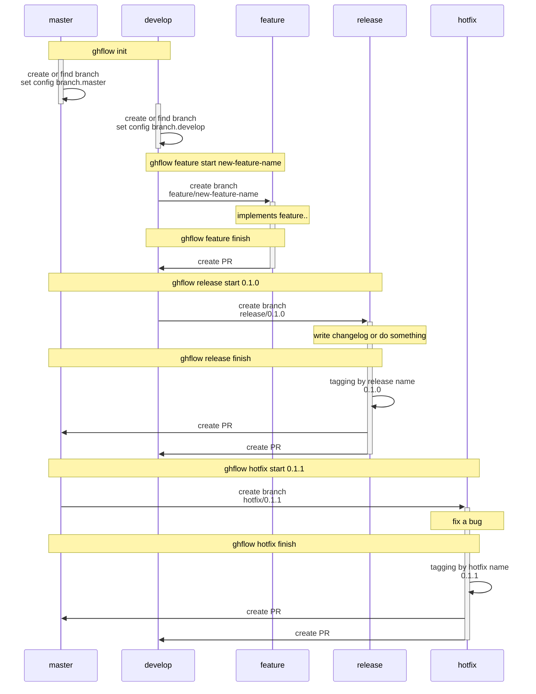

```mermaid
sequenceDiagram
participant master
participant develop
participant feature
participant release
participant hotfix

Note over master,develop: ghflow init
activate master
master->>master: create or find branch <br> set config branch.master
deactivate master
activate develop
develop->>develop: create or find branch <br> set config branch.develop
deactivate develop

Note over develop, feature: ghflow feature start new-feature-name
develop->>+feature: create branch <br> feature/new-feature-name
Note over feature: implements feature..

Note over feature, develop: ghflow feature finish
feature->>-develop: create PR

Note over master, release: ghflow release start 0.1.0 
develop->>+release: create branch <br> release/0.1.0
Note over release: write changelog or do something
Note over master, release: ghflow release finish
release->>release: tagging by release name <br> 0.1.0
release->>master: create PR
release->>-develop: create PR

Note over master,hotfix: ghflow hotfix start 0.1.1 
master->>+hotfix: create branch <br> hotfix/0.1.1
Note over hotfix: fix a bug
Note over master,hotfix: ghflow hotfix finish
hotfix->>hotfix: tagging by hotfix name <br> 0.1.1
hotfix->>master: create PR
hotfix->>-develop: create PR

```